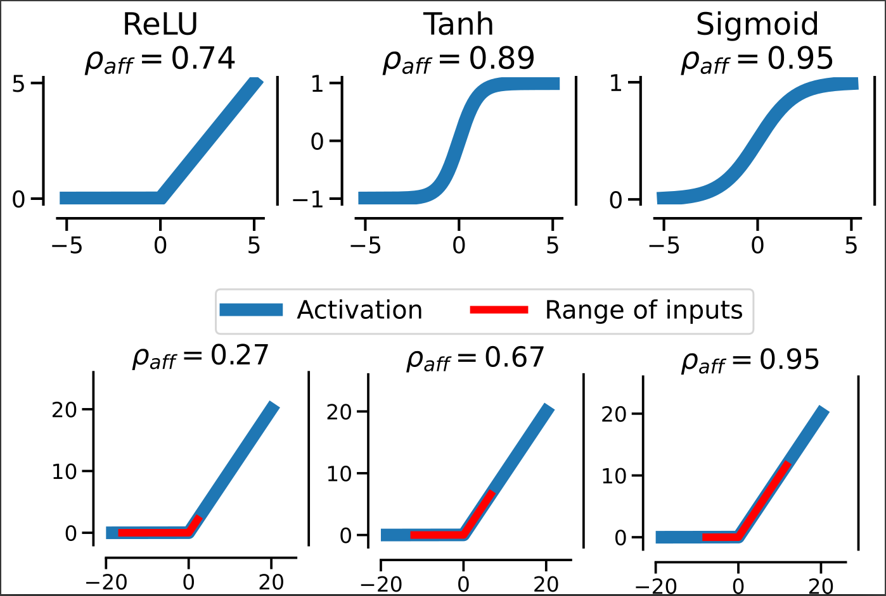
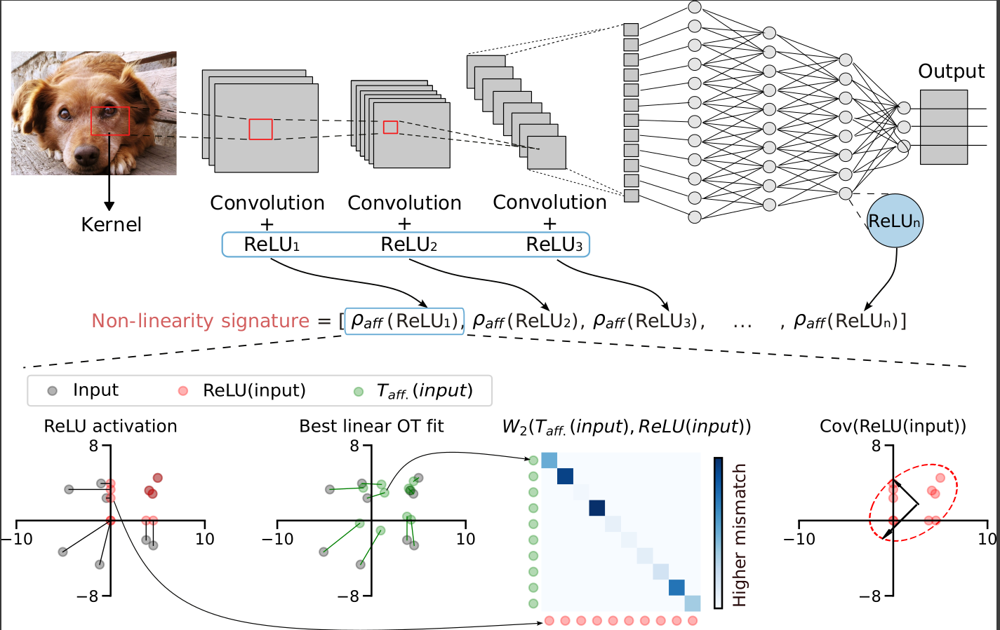

# From Alexnet to Transformers: Measuring the Non-linearity of Deep Neural Networks with Affine Optimal Transport

Official code for computing Affinity Score and Non-linearity signatures from [From Alexnet to Transformers: Measuring the Non-linearity of Deep Neural Networks with Affine Optimal Transport](arxiv.org/abs/2310.11439) (2023).

## Installation 

You can install all the required package using `conda`:
```
conda env create -f environment.yml
```

Or directly with `pip`:
```
pip install -r requirements.txt
```

## Play with affinity score



The two notebooks provided show how to compute affinity scores for activation functions separately, with examples on polynomial functions and on popular activation functions.

## Compute non-linearity signatures



To run the code and compute non-linearity signature of a given architecture `ARCH` on a given dataset `DATASET`:

```
python src/aff_scores_torch.py --model_name ARCH --val_dataset DATASET
```

For instance, to measure non-linearity signature of `alexnet` on `cifar10`:

```
python src/aff_scores_torch.py --model_name alexnet --val_dataset cifar10
```

`ARCH` should be the name of an architecture with pretrained model available on `torchvision`. You can find the list of all architectures [here](https://pytorch.org/vision/main/models.html). `DATASET` should be one among `cifar10, cifar100, imagenet, random, fashionMNIST`.
