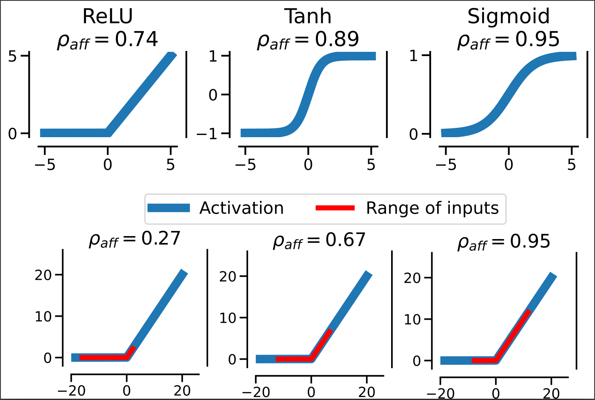
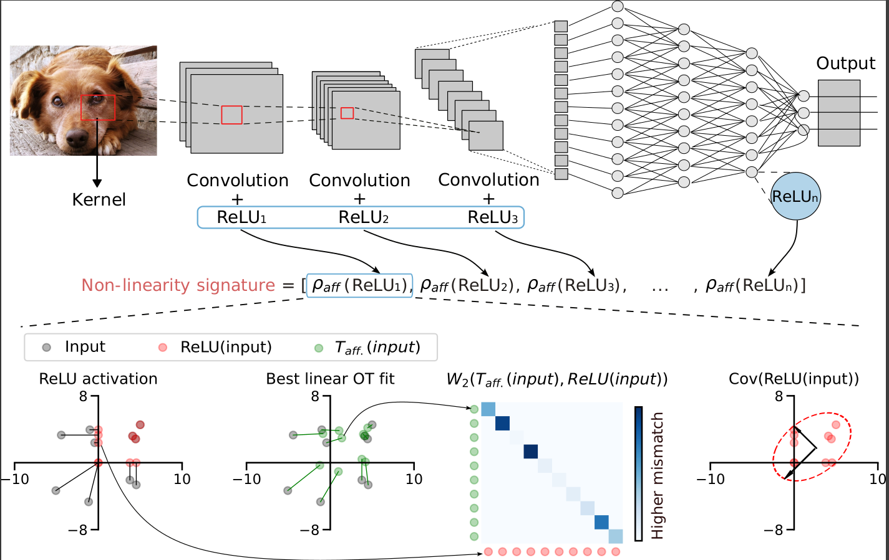

# [CVPR 2025] From Alexnet to Transformers: Measuring the Non-linearity of Deep Neural Networks with Affine Optimal Transport

[](https://arxiv.org/abs/2310.11439)

**Authors:** [Quentin Bouniot*](https://qbouniot.github.io/), [Ievgen Redko*](https://ievred.github.io/), [Anton Mallasto](https://sites.google.com/view/antonmallasto/home), [Charlotte Laclau](https://laclauc.github.io/), Oliver Struckmeier, Karol Arndt, [Markus Heinonen](https://markusheinonen.github.io/), [Ville Kyrki](https://www.aalto.fi/en/people/ville-kyrki), [Samuel Kaski](https://kaski-lab.com/)

## Abstract

In the last decade, we have witnessed the introduction of several novel deep neural network (DNN) architectures exhibiting ever-increasing performance across diverse tasks. Explaining the upward trend of their performance, however, remains difficult as different DNN architectures of comparable depth and width -- common factors associated with their expressive power -- may exhibit a drastically different performance even when trained on the same dataset. In this paper, we introduce the concept of the non-linearity signature of DNN, the first theoretically sound solution for approximately measuring the non-linearity of deep neural networks. Built upon a score derived from closed-form optimal transport mappings, this signature provides a better understanding of the inner workings of a wide range of DNN architectures and learning paradigms, with a particular emphasis on the computer vision task. We provide extensive experimental results that highlight the practical usefulness of the proposed non-linearity signature and its potential for long-reaching implications.

## Installation 

You can install all the required package using `conda`:
```
conda env create -f environment.yml
```

Or directly with `pip`:
```
pip install -r requirements.txt
```

## Play with affinity score



The two notebooks provided show how to compute affinity scores for activation functions separately, with examples on polynomial functions and on popular activation functions.

## Compute non-linearity signatures



To run the code and compute non-linearity signature of a given architecture `ARCH` on a given dataset `DATASET`:

```
python src/aff_scores_torch.py --model_name ARCH --val_dataset DATASET
```

For instance, to measure non-linearity signature of `alexnet` on `cifar10`:

```
python src/aff_scores_torch.py --model_name alexnet --val_dataset cifar10
```

`ARCH` should be the name of an architecture with pretrained model available on `torchvision`. You can find the list of all architectures [here](https://pytorch.org/vision/main/models.html). `DATASET` should be one among `cifar10, cifar100, imagenet, random, fashionMNIST`.

## Citations
If you find our work useful, please star this repo and cite:

```bibtex
@InProceedings{Bouniot_2025_CVPR,
    author    = {Bouniot, Quentin and Redko, Ievgen and Mallasto, Anton and Laclau, Charlotte and Struckmeier, Oliver and Arndt, Karol and Heinonen, Markus and Kyrki, Ville and Kaski, Samuel},
    title     = {From Alexnet to Transformers: Measuring the Non-linearity of Deep Neural Networks with Affine Optimal Transport},
    booktitle = {Proceedings of the Computer Vision and Pattern Recognition Conference (CVPR)},
    month     = {June},
    year      = {2025},
    pages     = {25250-25260}
}
